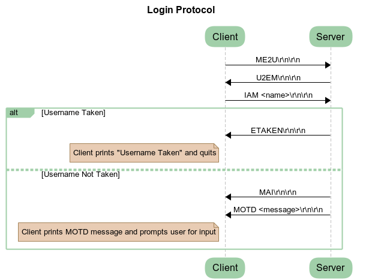
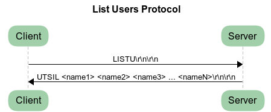
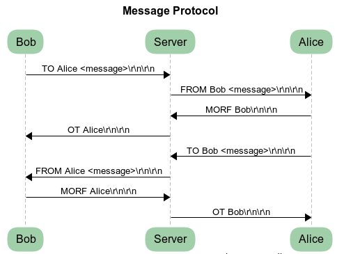
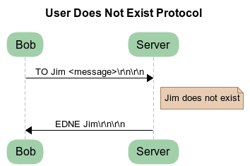
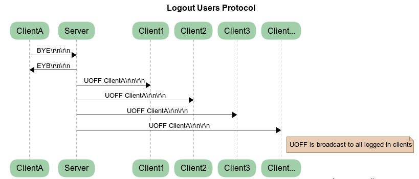
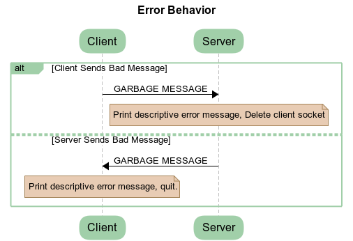
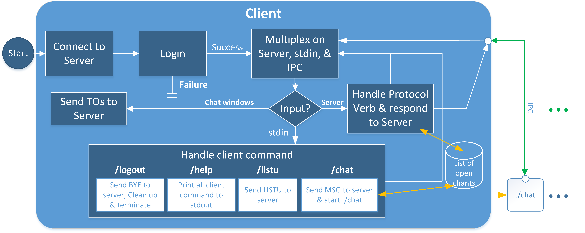
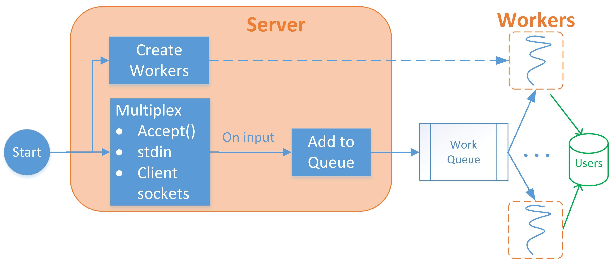

# CSE392 Spring 2018 Homework 0

In this course a Linux virtual machine will be used as the development environment, and Docker will be used to make your applications portable and deployable.
In addition, we will provide you with a git repository hosted on a department GitLab server.
This document will briefly outline how to set up the git respostiory, virtual machine, and Docker.

## Setting up your CSE392 Git repository

Git is an open-source distributed version control system.
Git repositories will be used to manage your homework submissions.
The use of git allows the Professor and TAs to access and view your your code remotely in order to assist you.
Additionally, you have the option of working with a partner and sharing a git repository.
Git will allow you and your partner to efficiently work on your homework assignments in tandem.

You will use a CSE department supported git web interface called Gitlab to manage your git respository.
Gitlab is similar to other git interfaces such as github, bitbucket, etc.
These services are nothing more than INTERFACES to git, not git itself.
You *may not* use external repositories as we will use the repo provided to you to grade your submitted work and share gradesheets with you.

To setup your repository:

1. Navigate to [https://gitlab03.cs.stonybrook.edu](https://gitlab03.cs.stonybrook.edu/) and log into it with you CS email account (user name only, do not include the `@cs.stonybrook.edu`).
If you forgot your CS email password you can reset it by following the instructions [here](https://auth02.cs.stonybrook.edu:10443/react/).
If those instructions fail, please email `rt@cs.stonybrook.edu` requesting a password reset.
A response from them may take up to 24-48 hours.
2. Once logged in, fill out this [form](https://goo.gl/forms/A3raoQIPJWEbH8P23) and wait to receive an email from cse392@cs.stonybrook.edu confirming repository creation.
A response from them may take up to 24-48 hours. **Fill out only one form per group.**

## Setting up the Virtual Machine

The Linux Mint 18.3 "Sylvia" - Cinnamon (64-bit) distribution will be used as this semester's development environment.
Any virtualization software can be used to run your virtual machine, however, we advise that you take advantage of the free VMWare license provided to Stony Brook students.

#### Getting VMware

Download VMWare Workstation for Windows/Linux or VMWare Fusion for OSX.

You can find VMware on Stony Brook's [OnTheHub](https://stonybrook.onthehub.com) software distribution site, under the vmware tab.
If you're running Linux or Windows you'll need **VMware Workstation 14**.
If you're running MacOS you'll need **VMware Fusion 10**.

If you need help installing VMWare or retrieving the license you please contact Stony Brook's [Customer Engagement and Support](https://it.stonybrook.edu/services/service-center).

#### Installing Linux Mint

Download the Linux Mint 18.3 "Sylvia" - Cinnamon (64-bit) distribution from [here](https://linuxmint.com/edition.php?id=246).

If you are using VMWare follow these [instructions](https://partnerweb.vmware.com/GOSIG/Ubuntu_16_04_LTS.html) in order to install the distribution you just downloaded.
Otherwise follow the instructions listed in the documentation of the virtualization software that you are using.

# Docker

Docker is a platform that provides a way to automate the development and deployment of applications as portable self-sufficient **containers**.
A container is an image that has everything that a piece of software needs to run including code, runtime tools, libraries, and settings.

Docker and Docker Compose will be used for this course as they:
* Give you complete control over how your program is ran.
* Easily run multiple instances of your program.
* Isolate your program from the rest of your operating system.

Follow the installation instructions below as the one's on docker's site do not work out of the box for Linux Mint.
Please take the time to complete the Docker [tutorial](https://docs.docker.com/get-started/#a-brief-explanation-of-containers).
You do not need a docker account to use docker.

The Docker tutorial is very extensive and you do not need to go through all of it. 
Most of the docker materials and commands will be provided / explained in the homework document. 
However, it is best to familiarize yourself with Docker as much as possible for your own knowledge. 

## Installing Docker in your VM

Run apt update to get latest repository information:
```sh
sudo apt update
```
Install some prerequisites:
```sh
sudo apt install apt-transport-https ca-certificates curl software-properties-common
```
Add Docker's official GPG key:
```
curl -fsSL https://download.docker.com/linux/ubuntu/gpg | sudo apt-key add -
```
Add the Docker repository:
```sh
sudo add-apt-repository "deb [arch=amd64] https://download.docker.com/linux/ubuntu xenial stable"
```
Apt update and Install docker:
```sh
sudo apt update
sudo apt install docker-ce
```

Add your user to the docker group. **You must logout and log back in after executing this command**
```sh
sudo usermod -aG docker $USER
```

Test it!
```sh
docker run hello-world
```

### Install Docker Compose

Download the script and make sure its executable
```sh
sudo curl -L https://github.com/docker/compose/releases/download/1.18.0/docker-compose-`uname -s`-`uname -m` -o /usr/local/bin/docker-compose && sudo chmod +x /usr/local/bin/docker-compose
```

### Install Docker Machine

Download the script && Make sure its executable
```sh
sudo curl -L https://github.com/docker/machine/releases/download/v0.13.0/docker-machine-`uname -s`-`uname -m` -o /usr/local/bin/docker-machine && sudo chmod +x /usr/local/bin/docker-machine
```

# Python

Some of the assignments in this course permit you to choose between working in Python or C.
If you choose to use python you need to ensure that you are working in the same environment that the TAs will grade in.

0. Install the supporting packages

```sh
sudo apt-get install -y make build-essential libssl-dev zlib1g-dev libbz2-dev libreadline-dev libsqlite3-dev wget curl llvm libncurses5-dev libncursesw5-dev xz-utils tk-dev
```

1. Install [pyenv](https://github.com/pyenv/pyenv-installer) in your vm. (It's just the curl command)
2. Close and reopen your shell and you should be able to run `pyenv versions` to test that it works correctly.
3. Run `pyenv install 3.6.4` to install the version of python we'll be using this semester. Not, this takes a while.
4. Run `pyenv global 3.6.4` to set the version of python to the correct one.
5. If you run either `python` or `python3` you should see 3.6.4 displayed as the version

### Modules

Lucky for us Python includes everything you need to do low level socket programming out of the box.
One thing you may encounter in you assignments is working with binary data in some of the more system's specific functions.
Python does have the [`struct`](https://docs.python.org/3/library/struct.html) and [`array`](https://docs.python.org/3/library/array.html) modules to assist with this but it can be cumbersome as the data's complexity increases.

We recommend taking a look now at the `struct` api just see how it works.
Essentially it makes you define a format string representing the various data types in your "struct" and after filling the struct with data you access it using python's index/slice operator `[]`.

To make life a little easier there is a module called [`construct`](https://construct.readthedocs.io/en/latest/).
Take a look here at how you accomplish [structs in construct](https://construct.readthedocs.io/en/latest/basics.html#structs).

You can see that you can name the fields just like you would in C albeit with an alternative syntax.
It is entirely optional to use this module but we will permit it if you find yourself wanting something more capable then the build in `struct` module.

To install it run:

```sh
pip install construct
```

Beyond this module no other third party libraries/modules are permitted. The grading environment is as follows:

```
Package    Version
---------- -------
construct  2.9.25
pip        9.0.1
setuptools 38.4.0
```
> Note: that `setuptools` and `pip` come with your installation of python and their version numbers do not matter.

> Also note that this doesn't mean you cannot install more things in your python environment if you so wish your project just cannot depend on them. (Example. a python linter that installs via pip)

# Homework 0

This part of the document will walk you through completing the academic honesty statement and running a simple client-server program in both your virtual machine and in Docker.

## Directory Layout

```
hw0
├── academic_honesty.txt
├── docker-compose.yml
├── echo_client
│   ├── Dockerfile
│   ├── Makefile
│   └── echo_client.c
└── echo_server
    ├── Dockerfile
    ├── Makefile
    └── echo_server.c
```

Inside of the `hw0` folder you'll find the above directory layout.

* `academic_honesty.txt` - An academic honesty statement that you will sign in the section below.
* `docker-compose.yml`   - A docker compose file that will configure an echo server to run in a docker container.
* `hw0/echo_client`      - A folder containing a `Makefile`, `Dockerfile`, and `C` file for an `echo_client`.
* `hw0/echo_server`      - A folder containing a `Makefile`, `Dockerfile`, and `C` file for an `echo_server`.

## Academic Honesty Statement

In this course we take academic honesty EXTREMELY seriously.
Please read and sign the statement in `academic_honesty.txt`.
Once finished, commit and push your changes to the Gitlab repository.

## Echo Client/Server in a VM

We'll start off by running the client/server on a Linux virtual machine.
This is how you'll be running your code during development and testing.
  
First read through the `Makefile` and `echo_server.c`files so that you have a basic understanding of how this program is compiled and run.
Next compile the server and run it in the background, on a port of your choice, using the following commands.

```sh
make clean all
./echo_server [PORT] &
```

Then `cd` into the `hw0/echo_client` directory and do the same for the `Makefile` and `echo_client.c` files in this directory.
Next compile and run the client using the following commands.

```
make clean all
./echo_client localhost [PORT]
```

You should now be able to type anything you want into the client and have it echoed back to you by the server.
You can also run multiple instances of the client to see how it behaves with the server.

Take a screenshot of the client and server running in your Virtual Machine and upload it to your Gitlab repository under the hw0 folder as `hw0/vm.png`.

A setup like this is nice for development and testing, however, it's not so useful for deployment.
Every single time someone wants to run an instance of the program they have to compile and run it on every server hosting it.
In the next section of this document we'll show you how Docker is used to make the echo server application deployable.

## Echo Client/Server in Docker

Start off by reading through the `Dockerfile`s located in `hw0/echo_client` and `hw0/echo_server` and the `docker-compose.yml` file located in `hw0/`.
Next run the following command to bring up a dockerized instance of the echo server.

```sh
docker-compose up -d
```

If the command executed successfully you should get something similar to the following output when you run `docker-compose ps`.

```sh
$ docker-compose ps
      Name                     Command              State           Ports         
----------------------------------------------------------------------------------
hw0_echo_server_1   /bin/sh -c ./echo_server 5000   Up      0.0.0.0:5000->5000/tcp
```

In order to connect to a dockerized instance of the client to server we need to first build the image and then run it on the same network as the server.
Run the following commands to build and run the client.

```sh
docker build echo_client -t echo_client:latest
docker run -it --network=host echo_client
```

You should now be able to type anything you want into the dockerized client and have it echoed back to you by the dockerized server.
You can also run multiple instances of the dockerized client to play around with docker and to see how it behaves with the dockerized server.

Take a screenshot of the running dockerized client and server and upload it to your Gitlab repository under the hw0 folder as `hw0/docker.png`.

## How to submit your assignment

To submit your assignment for grading tag the commit you intend to submit with `hw0` before the deadline.
This can be done through the Gitlab user interface or through the git command line using the following command.

```sh
git tag -a hw0 [commit]
git push origin --tags
```

> :warning: You only get one change to tags.
> Make sure all your files are committed and push to the gitlab server before you tag. 

# CSE 392 - Spring 2018 - Homework 1

## **Client Due in Lecture on Thursday 02/22/18**
## **Server Due on Sunday 03/04/18 @ 11:59PM**

# Introduction

In this assignment you will be creating a chat service much like Google's Hangouts, called **ME2U Chat**.
The goal is to learn about network programming in C.
You will implement the service so that it adheres to the **ME2U Protocol**.

The concept of a protocol is an important one to understand.
When implementing the protocol you need to follow the requirements and description **TO THE LETTER**.
The idea is to create a standard so that anyone implementing the `ME2U` Protocol will be able to connect and operate with any other program implementing the same protocol.
Any client and chat should work with any server if the protocol is used correctly.

You may also want to test your client by connecting to another group’s server, and your server by having other group’s clients connect to it.
This is a good way to ensure that the protocol is implemented correctly in your client/server programs.
While we encourage testing this way, THIS IS NOT an open invitation to share code with other groups.
You should not be showing or sharing code with anyone else.
To perform these tests you should simply be telling your client programs to connect to the IP address and port number at which these servers are running at.
You have been warned!

# Helpful Resources

The relevant sections from __UNIX Network Programming__ are 2.2, 2.4, 2.9-10, and chapters 3-5.

A pretty good reference on sockets which summarizes the man pages can be [found here](https://web.archive.org/web/20161015220642/http://www.python4science.eu/sockets.html).

Additionally, you may also want to read [Beej’s Guide to Network Programming](http://beej.us/guide/bgnet/).
It has a good mix of tutorials, explanations, and descriptions of the functions you need to use for this assignment.

## Using netcat as a faux server

You can use **netcat** as a faux server to test your client program.
First create a basic server listening on port **PORT** on localhost.

```
$ nc -C -l -p PORT
```

That's all you need to do.
The **netcat** program is now waiting to accept connections on port **PORT**, and it will write anything it receives to **stdout**.
So now if you have your client program to connect to localhost **PORT**, you should see the protocol displayed plainly.

Netcat will also allow you to type back to the connected socket if you type in it.
You can type out a protocol response, and then **press enter twice** to send `\r\n\r\n`.
To end the netcat program, press **ctrl-c** to terminate.

## Seeing raw bytes over the network interface

You can use [tcpdump(8)](http://linux.die.net/man/8/tcpdump) or [ngrep(8)](http://linux.die.net/man/8/ngrep) to watch all network communications over a particular device.

The below instructions will focus on using **ngrep** as a way to monitor both the hex and ASCII values of all network communications over a device on your machine over a particular port.

```sh
sudo apt-get install ngrep
```

Use **ngrep** with the following configuration to see all the raw traffic going between the server and client programs.

```
sudo ngrep -qx -d DEVICE  port PORT
```

You need to replace **DEVICE** and **PORT** with the appropriate values. You can get device by running the **ip addr show** program.

```
$ ip addr show
1: lo: <LOOPBACK,UP,LOWER_UP> mtu 65536 qdisc noqueue state UNKNOWN group default qlen 1000
    link/loopback 00:00:00:00:00:00 brd 00:00:00:00:00:00
    inet 127.0.0.1/8 scope host lo
       valid_lft forever preferred_lft forever
    inet6 ::1/128 scope host
       valid_lft forever preferred_lft forever
2: wlp2s0: <BROADCAST,MULTICAST,UP,LOWER_UP> mtu 1500 qdisc pfifo_fast state UP group default qlen 1000
    link/ether xx:xx:xx:xx:xx:xx brd ff:ff:ff:ff:ff:ff
    inet xxx.xxx.xxx.xxx/22 brd xxx.xxx.xxx.255 scope global dynamic wlp2s0
       valid_lft 10450sec preferred_lft 10450sec
    inet6 xxxx::xxxx:xxx:xxxx:xxxx/64 scope link
       valid_lft forever preferred_lft forever

```

On the machine that `ip addr show`  was run on, one could replace **\<device\>** with **lo** or **wlp2s0**.
If you wanted to listen on localhost over port 1234, you would run **ngrep** with the following arguments.
Then try to connect a client and watch the communications come pass through the wire. (It requires root privileges to sniff the traffic)

```
sudo ngrep -qx -d lo port 1234
```

To quit **ngrep** press **ctrl-c**.

## Colored Messages

To make things easier to read, you should use the following ansii escape codes to help color your messages on the server screen.

| Verbose    | Errors     | Default |
|------------|------------|---------|
| \x1B[1;34m | \x1B[1;31m | \x1B[0m |

> :nerd: If you don't remember what the ansii escape codes are/do take a look [here](http://ascii-table.com/ansi-escape-sequences.php).

## IPC

Later in this assignment you will need to use `IPC` to communicate between the client and chat windows.

On a Linux enviornment there are many forms of `IPC` that you can use such as [pipes and FIFOs](https://linux.die.net/man/7/pipe), [unix domain sockets](https://linux.die.net/man/7/unix), and [shared memory](https://linux.die.net/man/7/shm_overview).

## I/O Multiplexing

The client and server will need to use some form of I/O multiplexing in order to complete their tasks.

I/O multiplexing is available through the following interfaces - [select](http://linux.die.net/man/2/select), [poll](http://linux.die.net/man/2/poll), and [epoll](http://linux.die.net/man/2/epoll_create).
They all have their pros and cons, but it is up to you to decide which one(s) your client and server will use.
If you need help making a decision about which one to use, take a look at [epoll vs kqueue](http://people.eecs.berkeley.edu/~sangjin/2012/12/21/epoll-vs-kqueue.html) and [select/poll/epoll](https://www.ulduzsoft.com/2014/01/select-poll-epoll-practical-difference-for-system-architects/).

# ME2U Protocol

## Notes

The diagrams below represent exchanges in the `ME2U` protocol, which the client and server will use for communication.
- The protocol is in plain text
- `\r\n\r\n` is the "terminating sequence" that denotes the end of a protocol message
    - This is a carriage return and line feed repeated twice
    - In hex this is `0x0D0A0D0A`
- Any components contained in `<` and `>` are meant to be dynamically filled in by your program and are **NOT** to be bracketed by `<` and `>`
    - Ex. `TO <name> <message>\r\n\r\n` could be `TO neal hello, friend!\r\n\r\n`
- Almost every protocol message has a reversed string reply that does **NOT** include the payload. Pay close attention to the format / required response
- Usernames are limited to 10 characters and cannot contain spaces

## Login Procedure

The login procedure starts when a client initiates a connection with the server.
The client and server will perform a handshake and the client will send the server a username.
If the client's username is available, the server will acknowledge it and send it the message of the day.

<!--
Title Login Protocol
Client->Server: ME2U\\r\\n\\r\\n
Server->Client: U2EM\\r\\n\\r\\n
Client->Server: IAM <name>\\r\\n\\r\\n
alt Username Taken
Server->Client: ETAKEN\\r\\n\\r\\n
Note left of Client: Client prints "Username Taken" and quits
else Username Not Taken
Server->Client: MAI\\r\\n\\r\\n
Server->Client: MOTD <message>\\r\\n\\r\\n
Note left of Client: Client prints MOTD message and prompts user for input
-->



## List User Procedure

The list user procedure starts when the client sends the server a request for a list of all users.
The server should respond with a list of all connected users.


<!--
Title List Users Protocol

Client->Server: LISTU\\r\\n\\r\\n
Server->Client: UTSIL <name1> <name2> <name3> ... <nameN>\\r\\n\\r\\n
-->



> :nerd: When implementing this protocol, you should think about how you can receive an arbitrarily sized list of users.

## Typical Messaging Procedure

Below is a simple exchange between two logged in clients.
When one of the clients tries to contact a client that does not exist, the server responds with an `EDNE` message. **NOTE THE ORDER OF THE MESSAGES**.
The `TO` is sent to the server, `FROM` is sent to the destination client, destination client responds with `MORF` **THEN** the server replies to the orignal client with an `OT` message.
**Note** the usernames being filled in to each corresponding message.

<!--
Title Message Protocol
Bob->Server: TO Alice <message>\\r\\n\\r\\n
Server->Alice: FROM Bob <message>\\r\\n\\r\\n
Alice->Server: MORF Bob\\r\\n\\r\\n
Server->Bob: OT Alice\\r\\n\\r\\n
Alice->Server: TO Bob <message>\\r\\n\\r\\n
Server->Bob: FROM Alice <message>\\r\\n\\r\\n
Bob->Server: MORF Alice\\r\\n\\r\\n
Server->Alice: OT Bob\\r\\n\\r\\n

Title User Does Not Exist Protocol
Bob->Server: TO Jim <message>\\r\\n\\r\\n
note right of Server: Jim does not exist
Server->Bob: EDNE Jim\\r\\n\\r\\n
-->



If the user does not exist you should implement the following protocol.



## Logout Procedure

When a client wants to log out it will send the server a `BYE` message.
After acknowledging the client, the server will inform all other connected clients that they have logged out by broadcasting a `UOFF` message.

<!--
Title List Users Protocol

ClientA->Server: BYE\\r\\n\\r\\n
Server->Client: EYB\\r\\n\\r\\n

Server->Client1: UOFF ClientA\\r\\n\\r\\n
Server->Client2: UOFF ClientA\\r\\n\\r\\n
Server->Client3: UOFF ClientA\\r\\n\\r\\n
Server->Client...: UOFF ClientA\\r\\n\\r\\n
note right of Client...: UOFF is broadcast to all logged in clients
-->



## Handling Errors

If the client or server receives a poorly formated message from their peer, they should immediately terminate the connection and print an error message.



# ME2U Client

This part of the homework document outlines the expected functionality and operation of a `ME2U` chat client.
This part of the homeework assignent must be implemented in the `C` programming language.

## Usage

Below is a help menu that describes the arguments needed to run the client.
Remember that options in **[  ]** are optional, and arguments which are not assigned a flag are positional.

```sh
./client [-hv] NAME SERVER_IP SERVER_PORT
-h                         Displays this help menu, and returns EXIT_SUCCESS.
-v                         Verbose print all incoming and outgoing protocol verbs & content.
NAME                       This is the username to display when chatting.
SERVER_IP                  The ip address of the server to connect to.
SERVER_PORT                The port to connect to.
```

> :nerd: To make things easier to read, use ansi escape sequences to color the messages your client prints.

## Overview

The ME2U Chat program will allow users logged into a ME2U Chat server to send messages to each other.
Chats between users will be displayed on the client machine in independent windows, just as Google Hangouts does.



The diagram above shows the internal control flow of the client.
On startup, the client will connect to the server using the specified `SERVER_IP` ip address and `SERVER_PORT` port number.
After establishing a connection with the server, the client will attempt to log in via the `ME2U` protocol.
If the client is able to successfully log in, it will listen for communication from the server while handling commands from `stdin`.

## Client Commands

In order to fulfill user requests, the client will handle input from `stdin`.
These commands are transparent to the server as it only involves the user and client program.

#### `/help`
* Prints all the commands which the client accepts, at minimum these four, to `stdout`.

#### `/logout`
* Initiates the logout procedure with the server.
* This command also closes all chat windows and open file descriptors prior to exiting.

#### `/listu`
* Requests a list of logged in users from the server, and prints the list to `stdout`.

#### `/chat <to> <msg>`
* This command requires the name of the user to send the message to, and the message to be sent.
* More information about this command can be found in the section below.
* If the user exists, this command should also spawn a chat window for further communication.
* If the user does not exist, then this command should print an error message.

## Chat Program

In order to simulate the functionality of Google Hangouts, which spawns new windows for every chat, you will have to implement a `chat` program that communicates with your client program.

When the user wants to begin a chat session with another user, they will run the `/chat` command.
If the recipient exists, the client should spawn an [xterm](https://linux.die.net/man/1/xterm) window running an instance of the `chat` program.
If the recipient does not exist, the client should print an error message.
A chat window should also be opened when the recipient's client receives the message.

Once both users have an `xterm` chat window open, they can freely send messages to one another.
Incoming messages should be proceeded by an `>` symbol, and outgoing messages by an `<` symbol.
It may also help to color these messages to make them easier to identify.
After a message is entered in the `xterm` window's `stdin`, the chat program should use some form of `IPC` to relay the message to the client.
The client then sends the message to the server for routing.

A user can close a chat window at anytime using either the close button on the `xterm` window, or by typing `/close`.
When the window is closed on one client, it should have no impact on the client who was chatting with the user, i.e., the client should not communicate with the server when this command is used.
If a user closes a chat window they must use the `/chat` command in the client to initiate the chat again and reopen the window.
The user who did not close their chat window should receive this message normally.

If implemented correctly, it doesn’t matter if the `xterm` window is closed.
Every time a message is received by the client it should check to see if a window already exists for that user, and if not, it will spawn one.
If the window does exist, then the message is passed through IPC and displayed appropriately on the chat window.
If one of the user's disconnects from the server or does not exist, but a message is sent to this user, the server will respond with an `EDNE` message.

# ME2U Server

This part of the homework document outlines the expected functionality and operation of a `ME2U` chat server.
This part of the homework assignment can be implemented in the `C` or `Python` programming languages.

## Usage

Below is a help menu that describes the arguments needed to run the server.
Remember that options in **[  ]** are considered optional, and arguments which are not assigned a flag are positional.

```sh
./server [-hv] PORT_NUMBER NUM_WORKERS MOTD
-h            Displays help menu & returns EXIT_SUCCESS.
-v            Verbose print all incoming and outgoing protocol verbs & content.
PORT_NUMBER   Port number to listen on.
NUM_WORKERS   Number of workers to spawn.
MOTD          Message to display to the client when they connect.
```
> :nerd: To make things easier to read, use ansi escape sequences to color the messages your server prints.

## Overview



The diagram above shows the internal control flow of the server.
On startup, the main thread will create `NUM_WORKERS` `workers` which will remain active for the lifetime of the server.
The main/multiplexer thread will also create a socket, bind it to a specified port, and begin listening for incoming connections.
Additionally, the `main/multiplexer` thread will also parse commands from `stdin` and pass them to the workers to be run.

Clients will attempt to establish a connection with the server, which will be accepted by the `main/multiplexer` thread.
For every connection that the main thread accepts, the login job will be sent to the worker queue and be handled by the next available worker.
The server will recieve messages from logged in users on their respective client sockets in the `main/multiplexer` thread. The `main/multiplexer` thread will simply pass these messages to workers to be processed appropriately.

## Server Commands

Aside from handling connections from various clients, the server also has to handle input from `stdin`.
These commands are transparent to the connected clients, and are mainly used as a way to gather information by the server operator.

#### `/users`
* Dumps a list of currently logged in users to `stdout`. (**NOTE:** this does not send anything over the network, this is only on the server side)

#### `/help`
* Prints all the commands which the server accepts, at minimum these three, to `stdout`.

#### `/shutdown`
* Cleanly shuts the server down by disconnecting all connected users, closing all open file descriptors, and freeing any allocated memory.

## How to submit your assignment

To submit your assignment for grading, tag the commit you intend to submit, with `hw1-client` for the client and `hw1-server` for the server, before the deadline.
This can be done through the Gitlab user interface, or through the git command line using the following command.

```sh
git tag -a hw1-XXXXXX [commit]
git push origin --tags
```

> :warning: You only get one change to tag.
> Make sure all your files are committed and push to the gitlab server before you tag.
>>>>>>> e0df429da71644b7ac13d0848156e8000f320436
